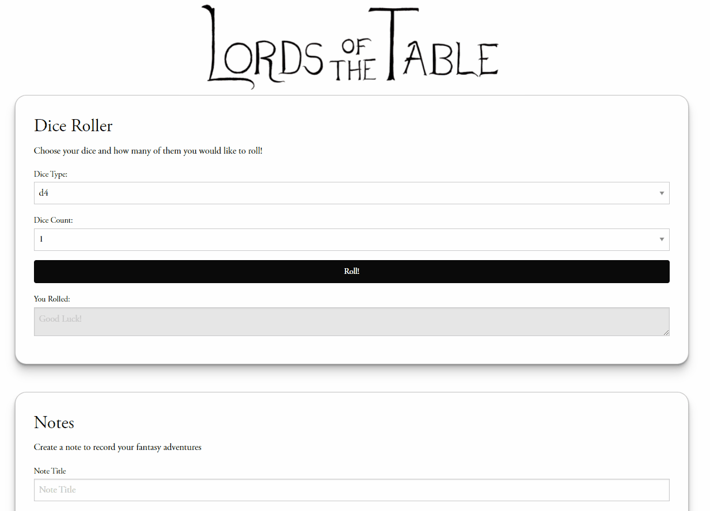

# Lords of the Table

A functional Dungeon Master companion app to track notes, dice rolls, enemies and characters for the table-top
role playing game, Dungeons and Dragons.

## Description

Our project is three modules that each offer different functionality.

* Module 1. 
A dice roller module that allows the user to select what type of dice they would like to roll, 
and how many of them at a time
* Module 2. 
A notes module that allows the user to create, save, and load notes regarding events, quests, and lore within the world of Dungeons and Dragons.
* Module 3. 
A character module that allows the user to create an NPC or a monster, save that character, and add a description. This module uses the 
Open5e API to access monster lists and stats for creating characters. This module also implements a visual random character generator using the Robohash API.

## Built With

* HTML
* CSS
* Javascript
* Foundation 

## [Website](https://mattparker124.github.io/lords-of-the-table/)

## Authors

* [Garret Hobson](https://github.com/GartTheSkeleton)
* [Matthew Parker](https://github.com/mattparker124)
* [Nathaniel Hernandez](https://github.com/thetryworks)

## Resources

* [Open5e API](https://open5e.com/)
* [Robohash API](https://robohash.org/)
* [Foundation](https://get.foundation/index.html)

## License

MIT License

Copyright (c) [2022] [Nathaniel Hernandez][Garret Hobson][Matthew Parker]

Permission is hereby granted, free of charge, to any person obtaining a copy
of this software and associated documentation files (the "Software"), to deal
in the Software without restriction, including without limitation the rights
to use, copy, modify, merge, publish, distribute, sublicense, and/or sell
copies of the Software, and to permit persons to whom the Software is
furnished to do so, subject to the following conditions:

The above copyright notice and this permission notice shall be included in all
copies or substantial portions of the Software.

THE SOFTWARE IS PROVIDED "AS IS", WITHOUT WARRANTY OF ANY KIND, EXPRESS OR
IMPLIED, INCLUDING BUT NOT LIMITED TO THE WARRANTIES OF MERCHANTABILITY,
FITNESS FOR A PARTICULAR PURPOSE AND NONINFRINGEMENT. IN NO EVENT SHALL THE
AUTHORS OR COPYRIGHT HOLDERS BE LIABLE FOR ANY CLAIM, DAMAGES OR OTHER
LIABILITY, WHETHER IN AN ACTION OF CONTRACT, TORT OR OTHERWISE, ARISING FROM,
OUT OF OR IN CONNECTION WITH THE SOFTWARE OR THE USE OR OTHER DEALINGS IN THE
SOFTWARE.

